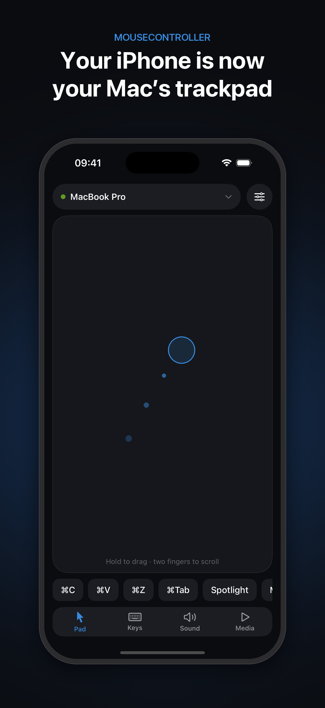
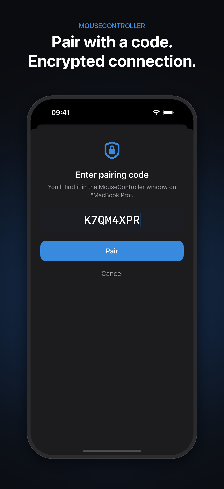
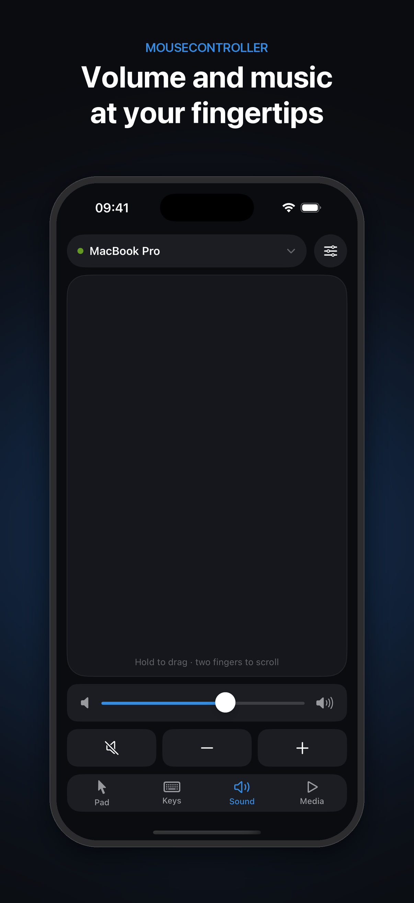

# MouseController

**Turn your iPhone into a wireless trackpad and keyboard for your Mac.**

<!-- TODO: replace with the App Store link once the app is live -->
**iPhone app:** coming soon to the App Store · **Mac app:** [download the latest release](https://github.com/slon3studio/MouseController/releases/latest)

  
  
  

---

## About

MouseController lets you control your Mac from your iPhone over your local network. Use the phone as a trackpad from the couch, during a presentation, or when your Mac is connected to a TV, without extra hardware.

It has two parts:

- **MouseController for iPhone**: the trackpad, keyboard and remote you hold.
- **MouseController for Mac**: a small companion app that runs on your Mac and performs the cursor, keyboard and media actions.

Both apps talk directly to each other on your Wi-Fi network or Personal Hotspot. Nothing goes through the internet.

## Features

- **Trackpad**: smooth cursor movement with adjustable speed and acceleration
- **Clicks**: tap to click, double-tap to double-click, two-finger tap to right-click
- **Drag and drop**: hold, then move
- **Scrolling**: two-finger scroll with momentum, vertical and horizontal
- **Gestures**: pinch to zoom, three-finger swipe up for Mission Control, left and right to switch desktops
- **Keyboard**: type on your Mac, plus Esc, Tab and arrow keys
- **Shortcuts**: copy, paste, undo, app switcher, Spotlight and Mission Control in one tap
- **Volume and music**: volume slider, mute, play/pause, next and previous track
- **Automatic discovery**: finds your Mac without typing an IP address
- **Secure pairing**: one-time pairing code, encrypted connection
- **Automatic reconnect** when Wi-Fi drops or the Mac app restarts

## Download

| App | Where to get it |
|---|---|
| iPhone | App Store (coming soon) <!-- TODO: App Store link --> |
| Mac | [GitHub Releases](https://github.com/slon3studio/MouseController/releases/latest) |

Use the newest version of both apps together. iPhone version 1.2 and later uses encrypted pairing and does not connect to older versions of the Mac app.

## Getting Started

1. **Install the Mac app.** Download `MouseControllerMac.zip` from [Releases](https://github.com/slon3studio/MouseController/releases/latest), unzip it, move `MouseControllerMac.app` to your Applications folder and open it.
2. **Allow Accessibility.** macOS asks for permission the first time. Click **Open System Settings** and turn on **MouseControllerMac** under **Privacy & Security → Accessibility**. Then quit the Mac app (menu bar icon → Quit) and open it again. Without this permission the Mac ignores all input.
3. **Join the same network.** Connect your iPhone and Mac to the same Wi-Fi network, or connect the Mac to your iPhone's Personal Hotspot.
4. **Open the iPhone app** and tap **Allow** when it asks to find devices on your local network.
5. **Pick your Mac** from the list under **Found nearby**.
6. **Enter the pairing code** shown in the Mac app's window (also in its menu bar menu). You only need to do this once per Mac.

You're connected. Move a finger on the trackpad to move the cursor. The **Keys**, **Sound** and **Media** tabs at the bottom open the keyboard, volume and music controls. The settings button at the top lists all gestures and lets you change the pointer speed.

## Requirements

- iPhone with iOS 17.6 or later
- Mac with macOS 14.6 or later
- Both devices on the same local network (Wi-Fi or Personal Hotspot)

## Privacy & Security

- **Local only**: the apps communicate directly over your local network. No accounts, no servers, no internet connection needed.
- **No data collection**: nothing is collected, stored or sent anywhere.
- **Encrypted**: the connection uses TLS with a key derived from the pairing code, so others on the same network can't see what you type or control your Mac.
- **Brute-force protection**: after 5 wrong pairing codes the Mac refuses all connections for 30 seconds.
- **New code**: if someone else saw your code, click **New code** in the Mac app. Every paired iPhone then has to enter the new code.

Permissions used:

- **iPhone: Local Network**, to find and connect to your Mac.
- **Mac: Accessibility**, to move the cursor, click and type on your behalf.

## Troubleshooting

**My Mac doesn't appear in the list**
- Make sure the Mac app is running (cursor icon in the menu bar).
- Check that both devices are on the same network. If you use a hotspot, make sure the Mac joined the hotspot of *this* iPhone. Two iPhones with the same name create hotspots with the same name.
- On iPhone, check **Settings → Privacy & Security → Local Network → MouseController** is on.
- As a fallback, tap **Enter IP address manually** and type the IP address shown in the Mac app.

**"That code didn't work"**
- Enter the code exactly as shown in the Mac app (letters and numbers; the dash is optional).
- After 5 wrong attempts, wait 30 seconds and try again.

**The iPhone connects, but the cursor doesn't move**
- Accessibility permission is missing or outdated. In **System Settings → Privacy & Security → Accessibility**, remove MouseControllerMac with **−**, add it again, then restart the Mac app. This is often needed after installing a new version.

**macOS says the app can't be opened**
- Download the app from the official [Releases](https://github.com/slon3studio/MouseController/releases/latest) page. If macOS still blocks it, open **System Settings → Privacy & Security** and click **Open Anyway**.

## For Developers

### Build from Source

1. Open `MouseController.xcodeproj` in Xcode 26 or later.
2. Select your team under **Signing & Capabilities** for both targets.
3. Run the **MouseControllerMac** scheme on your Mac and **MouseControllerPhone** on an iPhone.

Run only one copy of the Mac app at a time. A copy started from Xcode and a copy in Applications both use port 5555, and the second one can't accept connections until the first quits.

### Project Structure

| Folder | Contents |
|---|---|
| `MouseControllerPhone/` | iPhone app (SwiftUI): discovery, pairing, connection and trackpad |
| `MouseControllerMac/` | Mac companion app: network server, input injection, volume control |
| `Marketing/` | App Store screenshots, promo images and video, and the scripts that generate them |

### How It Works

- **Discovery**: the Mac app advertises itself over Bonjour as `_mousectrl._tcp` and listens on TCP port 5555. When the iPhone hosts a Personal Hotspot, it also probes the hotspot's address range in case Bonjour is unavailable.
- **Pairing and encryption**: both apps derive a TLS 1.2 pre-shared key (`TLS_PSK_WITH_AES_128_GCM_SHA256`) from the 8-character pairing code using HMAC-SHA256. The handshake only succeeds when both sides know the code (`Pairing.swift` in each app).
- **Protocol**: newline-delimited text commands, such as `MOVE:dx:dy`, `CLICK`, `SCROLL:dy:dx`, `KEY:text`, `COMBO:cmd:c` and `VOLUME:SET:0.5`. The Mac replies with `VOLUME_LEVEL` so the iPhone's slider matches the Mac's volume.
- **Input on the Mac**: posted as `CGEvent`s (requires Accessibility). Shortcuts are resolved against the current keyboard layout, so ⌘Z works on non-US layouts too.

## Support

Found a bug or have a question? [Open an issue](https://github.com/slon3studio/MouseController/issues).

## License

Copyright © 2026 Ivo Peterka. All rights reserved.
